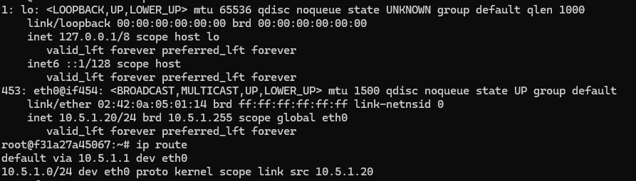
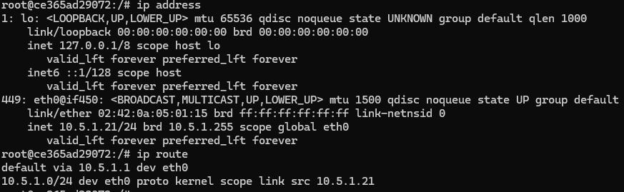
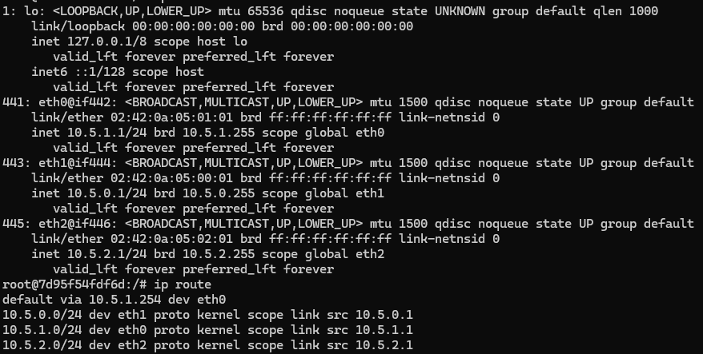
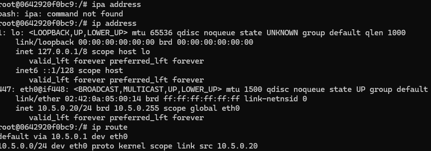
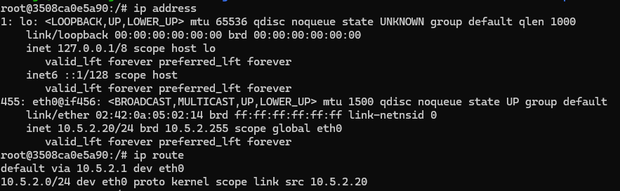
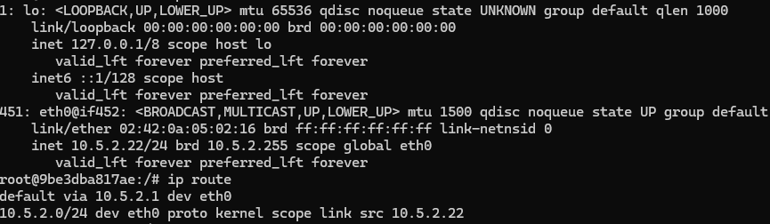

Hugo Bernardo Garmilla

Enlace video: https://drive.google.com/file/d/1HXRZ34c08sKn71PvfBTv_0GEI-NLj_ol/view?usp=sharing

Enlace github: https://github.com/hberng00/practica1_sico

practica1_sico
    -dmz
        -dmz1:Archivos para el funcionamiento de la dmz1
        -dmz2:Archivos para el funcionamiento de la dmz2
    -external:Archivos para el funcionamiento de la maquina externa
    -internal
        -internal12:Archivos para el funcionamiento de las maquinas internal 1 y 2
        -internal3:Archivos para el funcionamiento de la maquina internal 3
    -fw:Archivos para el funcionamiento del fw

Dmz1: 

Dmz2: 

Fw: 

External: 

Internal1: 

Internal2: 

Internal3: 
